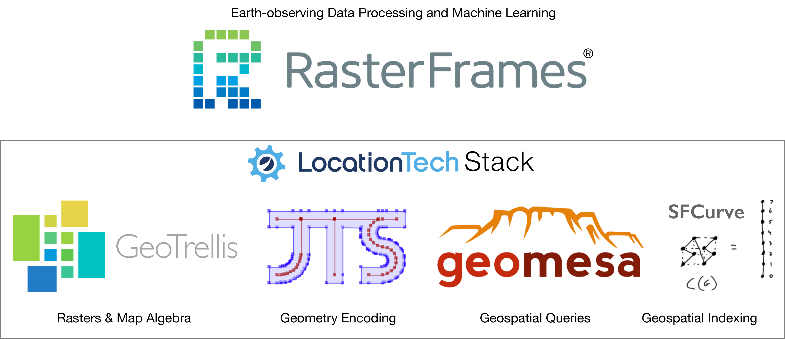

<sup style="vertical-align: top;">&reg;</sup>

 [](https://gitter.im/locationtech/rasterframes?utm_source=badge&utm_medium=badge&utm_campaign=pr-badge&utm_content=badge)

RasterFrames® brings together Earth-observation (EO) data access, cloud computing, and DataFrame-based data science. The recent explosion of EO data from public and private satellite operators presents both a huge opportunity as well as a challenge to the data analysis community. It is _Big Data_ in the truest sense, and its footprint is rapidly getting bigger. 

RasterFrames provides a DataFrame-centric view over arbitrary raster data, enabling spatiotemporal queries, map algebra raster operations, and compatibility with the ecosystem of Spark ML algorithms. By using DataFrames as the core cognitive and compute data model, it is able to deliver these features in a form that is both accessible to general analysts and scalable along with the rapidly growing data footprint.


Please see the [Getting Started](http://rasterframes.io/getting-started.html) section of the Users' Manual to start using RasterFrames.

## User Resources

* [RasterFrames Users' Manual](http://rasterframes.io/)
* [RasterFrames Jupyter Notebook Docker Image](https://hub.docker.com/r/s22s/rasterframes-notebook/)
* [Gitter Channel](https://gitter.im/locationtech/rasterframes)
* [Submit an Issue](https://github.com/locationtech/rasterframes/issues) 


## Contributing

Community contributions are always welcome. To get started, please review our [contribution guidelines](https://github.com/locationtech/rasterframes/blob/develop/CONTRIBUTING.md), [code of conduct](https://github.com/locationtech/rasterframes/blob/develop/CODE_OF_CONDUCT.md), and reach out to us on [gitter](https://gitter.im/locationtech/rasterframes) so the community can help you get started!

RasterFrames is part of the LocationTech Stack.



It is written in Scala, but with Python bindings. If you wish to contribute to the development of RasterFrames, or you
wish to build it from scratch, you will need [sbt](https://www.scala-sbt.org/). Then clone the repository from GitHub.

```bash
git clone https://github.com/locationtech/rasterframes.git
cd rasterframes
```

To publish to your local repository:

```bash
sbt publishLocal
```

You can run tests with

```bash
sbt test
```

and integration tests

```bash
sbt it:test
```

The documentation may be built with

```bash
sbt makeSite
```

Additional, Python sepcific build instruction may be found at [pyrasterframes/src/main/python/README.md](pyrasterframes/src/main/python/README.md)

## Copyright and License

RasterFrames is released under the Apache 2.0 License, copyright Astraea, Inc. 2017-2019.


