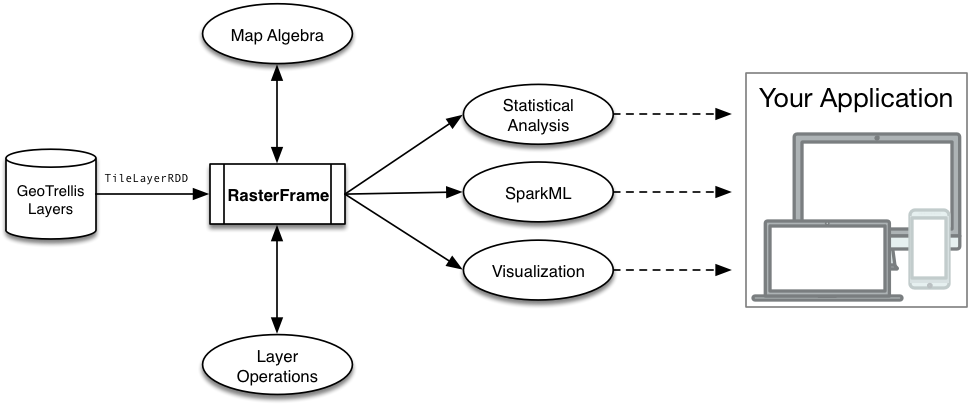

<sup style="vertical-align: top;">&trade;</sup>

[  ](https://bintray.com/s22s/maven/raster-frames/_latestVersion) [](https://travis-ci.org/s22s/raster-frames) [](https://codecov.io/gh/s22s/raster-frames)
 [](https://gitter.im/s22s/raster-frames?utm_source=badge&utm_medium=badge&utm_campaign=pr-badge&utm_content=badge)

_RasterFrames™_ brings the power of Spark DataFrames to geospatial raster data, empowered by the map algebra and tile layer operations of [GeoTrellis](https://geotrellis.io/).



> **RasterFrames™ is a new project under active development**. Feedback and contributions are welcomed 
as we continue to improve it.

## Getting Started

## Quick Start

### macOS

1. If not already, install [Homebrew](https://brew.sh/)
2. Run `brew install sbt`
3. Run `sbt new s22s/raster-frames.g8`

### Linux

1. Install [sbt](http://www.scala-sbt.org/release/docs/Installing-sbt-on-Linux.html)
2. Run `sbt new s22s/raster-frames.g8`

### Windows

1. Install [sbt](http://www.scala-sbt.org/release/docs/Installing-sbt-on-Windows.html)
2. Run `sbt new s22s/raster-frames.g8`

## General Setup

*RasterFrames* is published via Bintray's JCenter server. In sbt you introduce it with this build setting: 

```
resolvers += Resolver.jcenterRepo
``` 

(See [this](https://bintray.com/bintray/jcenter) for use of JCenter with other build tools.)

To use RasterFrames, add the following library dependency:

sbt:

```scala
libraryDependencies += "io.astraea" %% "raster-frames" % "x.y.z"
```

Maven:

```xml
<dependency>
  <groupId>io.astraea</groupId>
  <artifactId>raster-frames</artifactId>
  <version>x.y.z</version>
</dependency>
```

Note: It assumes that SparkSQL 2.1.1 is available in the runtime classpath.

## Documentation

* [Users' Manual](http://rasterframes.io/)
* [API Documentation](http://rasterframes.io/latest/api/index.html) 
* [List of available UDFs](http://rasterframes.io/latest/api/index.html#astraea.spark.rasterframes.ColumnFunctions)


## Copyright and License

All code is available to you under the Apache 2.0 License, copyright Astraea, Inc. 2017.


