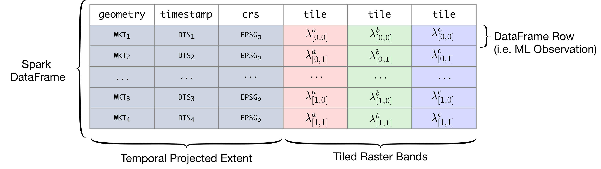

# Architecture

RasterFrames takes the Spark SQL DataFrame and extends it to support standard EO operations. It does this with the help of several other LocationTech projects:
[GeoTrellis](https://geotrellis.io/), [GeoMesa](https://www.geomesa.org/),
[JTS](https://github.com/locationtech/jts), and
[SFCurve](https://github.com/locationtech/sfcurve) (see below).

## Concepts

> * Cell
> * Cell Type
> * Tile
> * Extent
> * Coordinate Reference System (CRS)
> * Projected Extent 
> * Projected Raster
> * Layer 

RasterFrames introduces a new native data type called `tile` to Spark SQL. Each `tile` cell contains a 2-D matrix of "cell" (pixel) values, along with information on how to numerically interpret those cells. As showin in Figure 2, a "RasterFrame" is a Spark DataFrame with one or more columns of type `tile`. A `tile` column typically represents a single frequency band of sensor data, such as "blue" or "near infrared", discretized into regular-sized chunks, but can also be quality assurance information, land classification assignments, or any other discretized geo-spatiotemporal data. It also includes support for working with vector data, such as [GeoJSON][GeoJSON]. Along with `tile` columns there is typically a `geometry` column (bounds or extent/envelope) specifying the location of the data, the map projection of that geometry (`crs`), and a `timestamp` column representing the acquisition time. These columns can all be used in the `WHERE` clause when querying a catalog of imagery.

Raster data can be read from a number of sources. Through the flexible Spark SQL DataSource API, RasterFrames can be constructed from collections of (preferably Cloud Optimized) GeoTIFFs, [GeoTrellis Layers][GTLayer], and from an experimental catalog of Landsat 8 and MODIS data sets on the [Amazon Web Services (AWS) Public Data Set (PDS)][PDS]. 

> Update to match components in raster-io.md

[R]:https://www.rdocumentation.org/packages/base/versions/3.5.1/topics/data.frame
[Pandas]:https://pandas.pydata.org/
[GeoJSON]:https://en.wikipedia.org/wiki/GeoJSON
[GTLayer]:https://geotrellis.readthedocs.io/en/latest/guide/core-concepts.html#layouts-and-tile-layers
[PDS]:https://registry.opendata.aws/modis/
