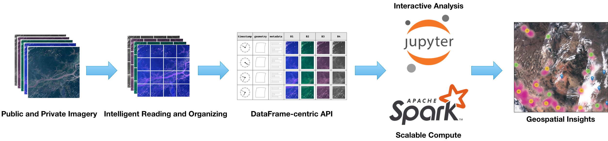

# RasterFrames

RasterFrames® brings together Earth-observation (EO) data access, cloud computing, and DataFrame-based data science. The recent explosion of EO data from public and private satellite operators presents both a huge opportunity and a huge challenge to the data analysis community. It is _Big Data_ in the truest sense, and its footprint is rapidly getting bigger. 

RasterFrames provides a DataFrame-centric view over arbitrary geospatial raster data, enabling spatiotemporal queries, map algebra raster operations, and interoperability with Spark ML. By using the DataFrame as the core cognitive and compute data model, RasterFrames is able to deliver an extensive set of functionality in a form that is both horizontally scalable as well as familiar to general analysts and data scientists. It provides APIs for Python, SQL, and Scala.

Through its custom [Spark DataSource](https://rasterframes.io/raster-read.html), RasterFrames can read various raster formats -- including GeoTIFF, JP2000, MRF, and HDF -- and from an [array of services](https://rasterframes.io/raster-read.html#uri-formats), such as HTTP, FTP, HDFS, S3 and WASB. It also supports reading the vector formats GeoJSON and WKT/WKB. RasterFrame contents can be filtered, transformed, summarized, resampled, and rasterized through [200+ raster and vector functions](https://rasterframes.io/reference.html).

As part of the LocationTech family of projects, RasterFrames builds upon the strong foundations provided by GeoMesa (spatial operations) , GeoTrellis (raster operations), JTS (geometry modeling) and SFCurve (spatiotemporal indexing), integrating various aspects of these projects into a unified, DataFrame-centric analytics package.

RasterFrames is released under the commercial-friendly [Apache 2.0](https://github.com/locationtech/rasterframes/blob/develop/LICENSE) open source license.

To learn more, please see the @ref:[Getting Started](getting-started.md) section of this manual.

The source code can be found on GitHub at [locationtech/rasterframes](https://github.com/locationtech/rasterframes).

## Related Links

* [Gitter Channel](https://gitter.im/locationtech/rasterframes)
* [Scala API Documentation](latest/api/index.html)
* [GitHub Repository](https://github.com/locationtech/rasterframes)
* [Astraea, Inc.](http://www.astraea.earth/), the company behind RasterFrames

## Detailed Contents

@@ toc { depth=4 }

@@@ index
* [Overview](description.md)
* [Getting Started](getting-started.md)
* [Concepts](concepts.md)
* [Raster Data I/O](raster-io.md)
* [Vector Data](vector-data.md)
* [Raster Processing](raster-processing.md)
* [Numpy and Pandas](numpy-pandas.md) 
* [Scala and SQL](languages.md)
* [Function Reference](reference.md)
* [Release Notes](release-notes.md)
@@@

